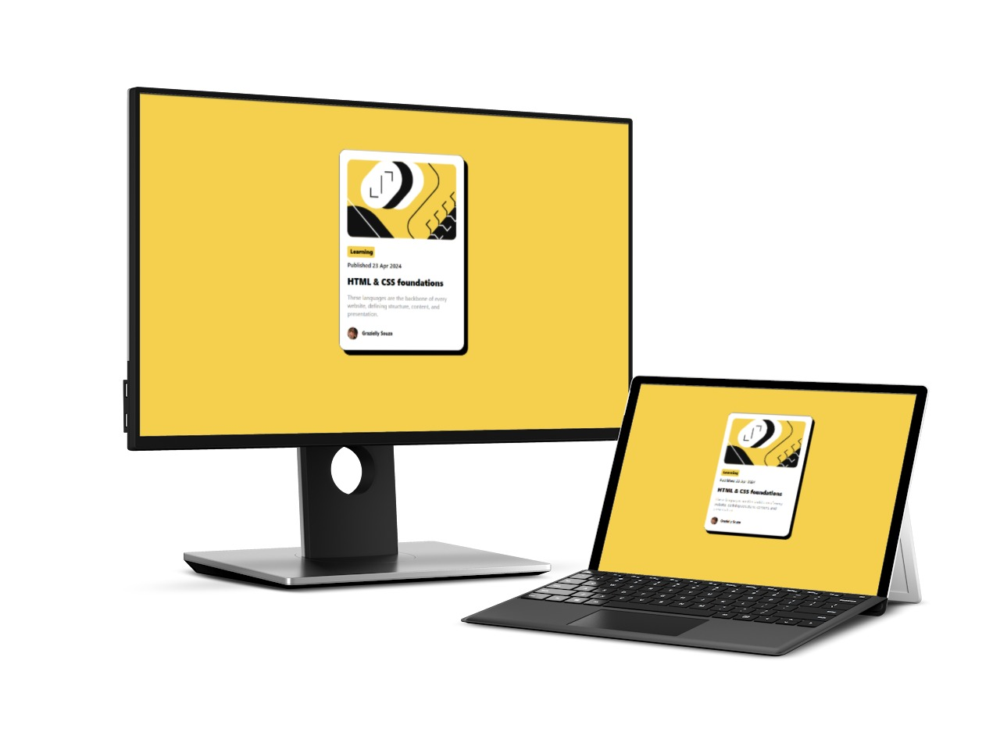
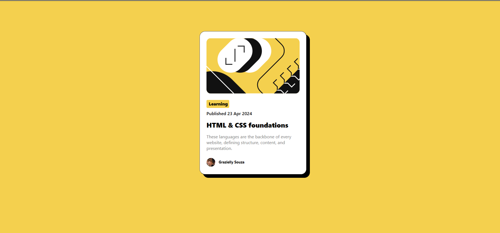
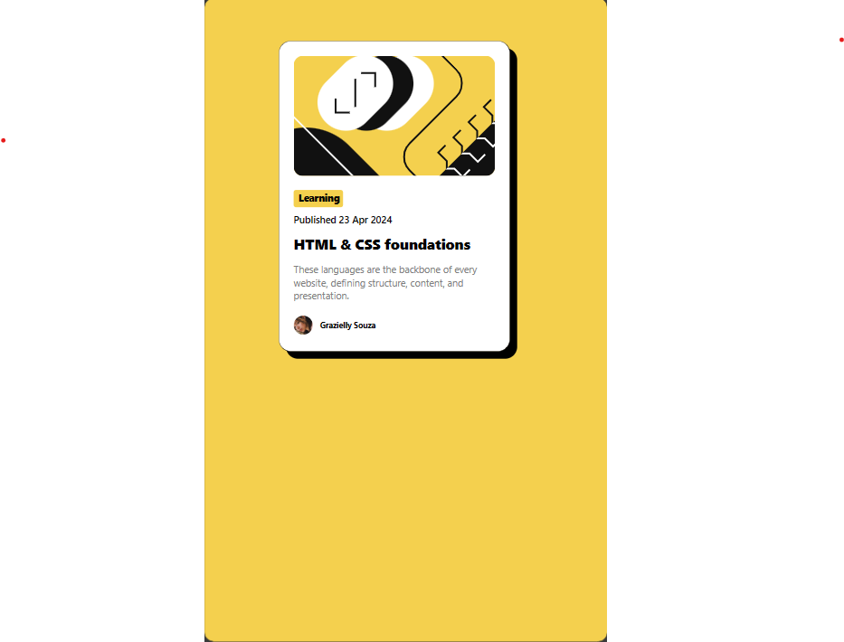

# ☕ Blog Preview Card
Enhancement Challenge on Frontend Mentor, Solution by Grazy =)
 Frontend Mentor challenges help you improve your coding skills by building realistic projects. 

## Table of content
- [Overview](#overview)
  - [Screenshot](#📸-screenshot)
  - [Links](#🔗-links)
- [My process](#💡-my-process)
  - [Built with](#build-with)
- [Author](#💞-author)
 
 

## Overview
### 📸 Screenshot
Mockups, desktop and laptop.

This is my solution: ⇧

.

.
# 💻 For desktop:

.

# 📱 For mobile:

</body>

## 🔗 Links

- Live URL: [blogcarddagrazys.com](https://grazysss.github.io/BlogCardGZ/)
- Repo URL: [On the GITHUB!!](https://github.com/grazysss/BlogCardGZ)

## 💡 My process
### Build with:
  - HTML
  - CSS
  - Flexbox
  - Figma
  - Git 
  - Github

## 💞 Author
- WebSite: [Currículo-Grazys on Github](https://grazysss.github.io/curriculo-grazy/)
- Twitter: [@sz_grazys](https://twitter.com/sz_grays)
- Instagram: [@grazysouzzax__](https://instagram.com/grazysouzzax__/)
- Github: [SIGAM-LÁ!!!](https://github.com/grazysss/)

.

.

.
# FINISH!!! ツ